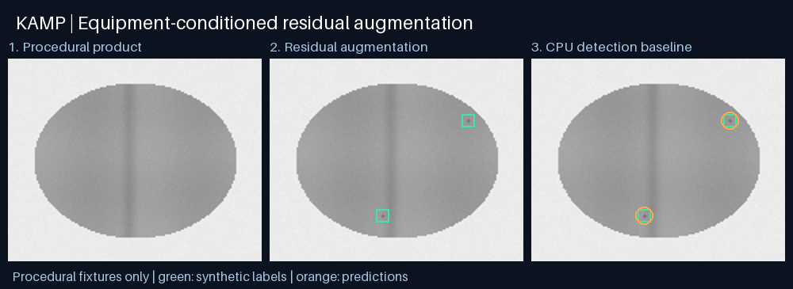
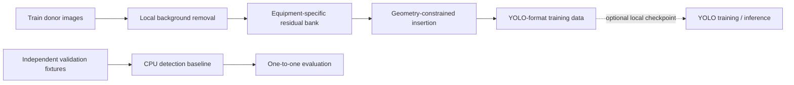

# KAMP X-ray Research Demo

### 희소 이물 신호를 학습 가능한 데이터로 확장하는 장비 조건부 증강

2026 KAMP 제조데이터 분석 경진대회를 준비하며 개발 중인 **X-ray 이물 탐지 연구의 공개 실행 데모**입니다. 장비별 이물 잔차를 분리하고, 제품 내부의 유효 위치에 합성 표적을 삽입하며, 탐지 결과를 일대일 매칭으로 평가하는 핵심 파이프라인을 담았습니다.

**연구 주제:** 희소 표적의 데이터 부족을 어떻게 보완하며, 검출률 향상과 추가 오탐 사이의 균형을 어떻게 평가할 것인가?



## 핵심 구현

- **Equipment-conditioned residual bank:** 국소 배경을 제거한 어두운 이물 코어를 장비별로 분리하고 동일 장비의 증강에 사용합니다.
- **Geometry-constrained augmentation:** 제품 내부 마스크, 패치 경계, 기존 표적과의 최소 간격을 함께 적용합니다. 고정 seed로 동일한 삽입을 재현합니다.
- **Detection evaluation:** 이미지별 일대일 매칭으로 중복 검출을 처리하고, 재현율·정밀도·영상당 미매칭 후보·point AP를 산출합니다.
- **ML integration:** YOLO 형식의 이미지·라벨을 생성하고, 사용자가 보유한 로컬 체크포인트를 학습·추론에 연결하는 선택적 어댑터를 제공합니다.



## 빠른 실행

Python 3.10 이상과 CPU만으로 실행할 수 있습니다.

```bash
git clone https://github.com/gigalove6783-pixel/kamp-xray-research-demo.git
cd kamp-xray-research-demo
python -m pip install -r requirements.txt
python demo.py --seed 2026 --output runs/demo
python -m unittest -v
```

생성 결과:

| 파일 | 내용 |
| --- | --- |
| `runs/demo/preview.png` | 증강 전후 및 탐지 결과 시각화 |
| `runs/demo/metrics.json` | 전체·장비별 point localization 평가 |
| `runs/demo/images/`, `labels/` | 합성 학습 12장·검증 24장과 YOLO 라벨 |
| `runs/demo/dataset.yaml` | 선택적 YOLO 학습용 설정 |

실행 예시의 원본 JSON은 [demo_metrics.json](demo_metrics.json)에 있습니다. **이 결과는 절차적으로 생성한 단순 예제에서의 파이프라인 작동 확인이며, 실제 KAMP 데이터의 성능이나 증강의 성능 개선을 입증하지 않습니다.** 검증 예제는 학습 잔차 bank 구성에 사용하지 않습니다.

## 실제 연구와 공개 데모의 범위

| 구성 | 진행 중인 KAMP 연구 | 이 저장소 |
| --- | --- | --- |
| 데이터 | 제조 X-ray 학습 데이터 | 코드로 생성한 가상 제품 영상만 제공 |
| 잔차 bank | 학습 표적에서 장비별 코어 추출 | 동일 핵심 원리의 경량 재구현; 합성 donor 사용 |
| 영역 제약 | 영상에서 제품·내부 구역 추정 | 합성 영상의 알려진 제품 마스크 사용 |
| 탐지 | YOLO GPU 학습 및 병렬 추론 | CPU 국소 대비 baseline + 선택적 YOLO 어댑터 |
| 평가 | 탐지 AP·누락·추가 후보 비교 | 독립적인 point AP@3px·정밀도·재현율 평가 |

공개 증강기는 **장비·위치 조건을 반영한 잔차 합성**입니다. GAN·확산 모델로 학습한 생성기가 아닙니다. CPU 탐지 baseline은 학습 모델이 아니며, 영상 밝기로 추정한 전경 내부에서 국소 대비를 계산합니다. 전경 임계값과 표적 크기는 합성 예제용입니다. 실제 제품이나 다른 장비로의 일반화는 별도 학습·검증이 필요합니다.

원 대회 데이터, 원 데이터에서 추출한 잔차 배열, 학습 가중치, 비공개 실험 로그는 포함하지 않습니다. 이 저장소는 학습·평가 소프트웨어 구성과 증강 방법을 검토할 수 있도록 정리한 공개 연구 데모입니다.

## 선택적 YOLO 연결

Ultralytics를 별도로 설치하고 사용 권한이 있는 **기존 로컬 체크포인트**를 지정합니다. 이 저장소는 체크포인트를 제공하지 않습니다.

```bash
python -m pip install ultralytics
python yolo_adapter.py train --weights /path/to/local.pt --data runs/demo/dataset.yaml --device cpu --epochs 10
python yolo_adapter.py predict --weights /path/to/local.pt --source runs/demo/images/val --device cpu
```

GPU 환경에서는 `--device 0`을 사용할 수 있습니다. 공개판에서 검증한 범위는 NumPy/Pillow CPU 데모와 단위 검사입니다. YOLO 어댑터의 실제 학습·추론은 이번 공개판에서 실행하지 않았으며, 사용자가 지정하는 모델·라이브러리 버전에 따라 추가 확인이 필요합니다. Ultralytics는 별도 의존성이며 해당 프로젝트의 라이선스를 따릅니다.

## 파일 안내

| 파일 | 검토할 구현 |
| --- | --- |
| [augmentation.py](augmentation.py) | 국소 배경 제거, 잔차 bank, 제약 기반 삽입 |
| [evaluation.py](evaluation.py) | 이미지 기반 탐지, 신뢰도 정렬, 중복을 방지하는 매칭 |
| [demo.py](demo.py) | 학습·검증 분리, 데이터 생성, 시각화, JSON 결과 |
| [yolo_adapter.py](yolo_adapter.py) | 로컬 체크포인트를 사용한 학습·추론 연결 |
| [test_pipeline.py](test_pipeline.py) | 삽입 국소성·재현성, 장비 분리, 중복·음성 사례 평가 |

## 검증과 다음 연구

공개 데모의 검사는 삽입이 제품 밖을 바꾸지 않는지, 다른 장비의 잔차가 섞이지 않는지, 동일 표적의 중복 예측이 성적으로 중복 집계되지 않는지 확인합니다. 연구에서는 증강 유무와 장비 조건을 분리한 비교 실험으로 탐지 성능과 추가 후보 부담을 함께 검토합니다. 최종 연구 모델이나 우승 성능을 주장하는 저장소는 아닙니다.
